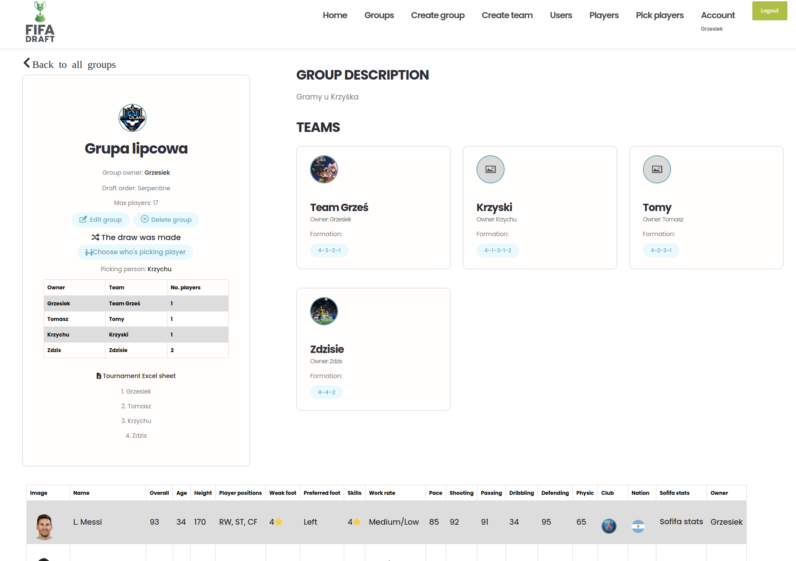

**TL;TR:**

The site allows you to create your dream team lineups in FIFA game. The idea is that when you get bored with playing the same rigid line-ups this app gives you the opportunity to change that. Group members choose players to their teams from all players over 79 (it can be changed) overall points available in FIFA 22 in a predetermined order one player at a time until the teams are full. **Line-ups must be set manually in the FIFA game settings.** There is an option for fixed and serpentine drafts.
Quick guide:

1. Create a Group, then a Team, and invite your friends to join your Group,

2. when everyone has a Team in your Group, draw the draft order,

3. the order in which players are selected changes automatically according to the order drawn,

4. players are selected through the "Pick players" button at the top of the page, select the team you want to select a player for, and then click Add player. The player selected by one person in the Group will not appear in the list again,

5. next person need to pick a player, repeat until the lineup is full,

6. if it is not your turn, you can add a player to the pending list who will be automatically selected when it is your turn,

7. complete the Excel file with the match schedule,

8. meet your friends and let the best one win!

# Project background:
I and my friends are football fans, we were playing in PES and FIFA games since we got our first computer/PSX. We are meet in high school and time-to-time we have FIFA tournaments. There came a point at which we get bored to play same teams, like Barca, Real, PSG, Chelsea, Bayern and somebody have idea to try make us own teams by transfer picked players in manual transfers in FIFA game. To play the first draft of the tournament, we had to use Google sheets and a Facebook messenger group to work out who was picking who - this method is not quite good, somebody must register all pick, and other people must remember which players are picked, and who is picking next. As I'm learning some Python, my friend gave me the idea to make such an application. At beginning, I could not imagine how to do it, but ultimately it works quite well and give me a lot of fun & satisfaction. 

# How it works:
To begin with, a profile should be created. Then we create a Group, where we set the password, the maximum number of players per team and other basic attributes. Then you create your Team. Now we need to invite friends to create their Profiles and Teams and join our Group using the password we provide. Once everyone is in a Group, the founder can use the button visible from the Group level and draw the order in which players will be selected. Once drawn, the Profile who starts picking is automatically indicated and this changes until everyone has full teams. A player can only be selected once per Group. Once he is selected, he will not appear in the list under 'Pick players'. We can check the order and other group information from the Group view. Picking a player is done via the 'Pick players' tab, which is highlighted when it is our turn. If it is not our turn, we can add a player to the pending list, so that when it is our turn he will be automatically selected (if he has not been selected by another player). In serpentine order of draft, first and last Profile picking two players (apart from first choice of first Profil). Once we have selected the player to pending list that someone before us has selected, we have to manually select who we want on our team. This is automated and must be repeated until all teams have the total number of footballers. You then need to create a copy and complete the Google sheets file, which contains the match schedule. You can find it above draft results. The final stage is to set up the teams in FIFA and arrange a tournament. Enjoy!

# What will be developed:
pagination on groups view, users and maybe players view,
readability and correctness of the code,
possibility to comment on other Profiles' players picks,
automatic replenishment of the match schedule file.

# Installation:
Docker:
1. Clone this repository: <code>git clone git@github.com:Grzegorz-Oledzki/fifa_draft_project.git</code>
2. Set up your database and static files ROOT. If you want to use local database go to draft_fifa folder > settings.py and comment lines with AWS database, uncomment fifa_local_db database. For static ROOT, uncomment line 165 and comment line 163 + type <code> python manage.py collectstatic</code>. 
3. Type:
<code>docker-compose -f docker-compose-dev.yml up -d --build</code>
then:
<code>docker-compose -f docker-compose-dev.yml exec web python manage.py migrate</code>
4. When you have error with database `django.db.utils.OperationalError: could not translate host name "db" to address: No address associated with hostname`
type:
<code>docker-compose -f docker-compose-dev.yml down -v</code>
and repeat point 3
5. Download players list from
<code>https://docs.google.com/spreadsheets/d/1gpkecwLkQqoKWks6z64AduIeDXPyIGKH/edit#gid=969632413</code>
6. Run <code>docker-compose -f docker-compose-dev.yml exec web python manage.py createsuperuser</code>
7. Log in and import players from .xlsx file on <code>http://127.0.0.1:8000/admin/players/player/ </code> 
8. Invite your friends and play! 

local:
1. Clone this repository: <code>git clone git@github.com:Grzegorz-Oledzki/fifa_draft_project.git</code>
2. Install requirements: <code>pip install -r requirements.txt</code>
3. Set up your database and static files ROOT. If you want to use local database go to draft_fifa folder > settings.py and comment lines with AWS database, uncomment fifa_local_db database. For static ROOT, uncomment line 165 and comment line 163 + type <code> python manage.py collectstatic</code>. 
4. Type:
<code>python manage.py migrate</code>
<code>python manage.py createsuperuser</code>
And finally:
<code>python manage.py runserver</code>
5. Download players list from
<code>https://docs.google.com/spreadsheets/d/1xOSDGC8MhbUNWA6OeNcWmpOjFRkPzLYb/edit?usp=sharing&ouid=107358397983377935642&rtpof=true&sd=true </code>
6. Run: <code>python manage.py createsuperuser</code>
7. Import players from .xlsx file on <code>http://127.0.0.1:8000/admin/players/player/ </code> 
8. Invite your friends and play! 

Screenshots: 

Home:

Players list:

Owner group view:

When it was your turn:

Team view:

